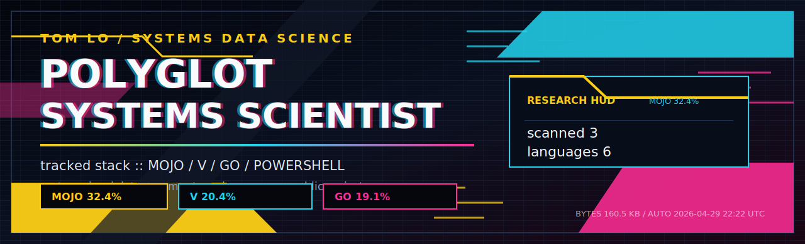
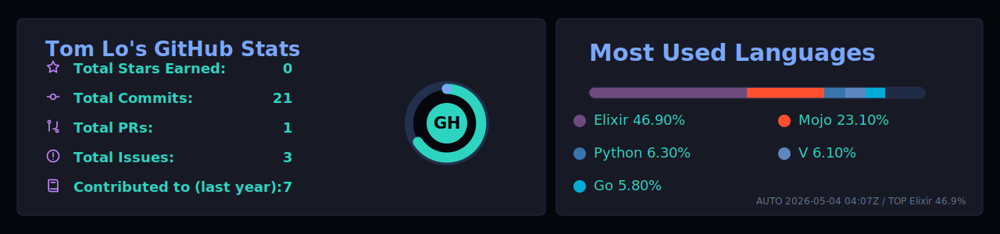

<!-- AUTO-GENERATED by scripts/build_readme.py. Edit the script, not this file. -->

<p align="center">
  
</p>

<p align="center">
  
</p>

<p align="center">
  <a href="https://github.com/TomLo-FStack?tab=repositories"></a>
  
  
  
  
  
</p>

## Language Matrix

**Positioning:** byte-weighted public source profile across Mojo, Elixir, V, and Go, tracking 5 source repositories, 5 active projects, and 10 detected languages from GitHub repository data.

<p align="center">


</p>

No new languages since the last daily scan.

| Language | Share | Bytes | Seen in repos |
| --- | ---: | ---: | --- |
| `Mojo` | `22.4%` | `52.0 KB` | mojo-data-structures-50 |
| `Elixir` | `21.5%` | `49.8 KB` | elixir-luv-v |
| `V` | `14.2%` | `32.8 KB` | ds50-speedforge |
| `Go` | `13.3%` | `30.7 KB` | ds50-speedforge |
| `PowerShell` | `12.1%` | `28.0 KB` | ds50-speedforge, elixir-luv-v, mojo-data-structures-50, pony-fin-terminal |
| `Python` | `6.9%` | `15.9 KB` | ds50-speedforge |
| `Julia` | `4.8%` | `11.1 KB` | ds50-speedforge |
| `Pony` | `3.4%` | `7.8 KB` | pony-fin-terminal |

## Mission Control

Systems builder focused on data structures, language experiments, and fast tooling.

Current work clusters around data structures, benchmarks, CLI tools, and language experiments. The heaviest source footprint is Mojo, Elixir, and V, based on 231.6 KB of language bytes from public non-fork source repositories.

```text
identity :: Tom Lo / Mojo, Elixir, and V
focus    :: data structures, benchmarks, CLI tools, and language experiments
repos    :: 5 active / 5 scanned
signals  :: stars 0 / forks 0 / new languages none
scan     :: daily GitHub language bytes / 2026-04-30 10:28 UTC
```

## Project Radar

<table>
<tr>
<td width="50%" valign="top">
<a href="https://github.com/TomLo-FStack/pony-fin-terminal"><strong>pony-fin-terminal</strong></a><br/>
<span>A small Pony finance terminal backed by public Stooq quote CSV data</span><br/><br/>
  <br/>
<sub>last push: <code>2026-04-30</code></sub>
</td>
<td width="50%" valign="top">
<a href="https://github.com/TomLo-FStack/elixir-luv-v"><strong>elixir-luv-v</strong></a><br/>
<span>Elixir Luv V: a polished Julia-style REPL shell for V</span><br/><br/>
  <br/>
<sub>last push: <code>2026-04-29</code></sub>
</td>
</tr>
<tr>
<td width="50%" valign="top">
<a href="https://github.com/TomLo-FStack/mojo-data-structures-50"><strong>mojo-data-structures-50</strong></a><br/>
<span>Mojo implementations for 50 classic data-structure LeetCode problems.</span><br/><br/>
  <br/>
<sub>last push: <code>2026-04-29</code></sub>
</td>
<td width="50%" valign="top">
<a href="https://github.com/TomLo-FStack/ds50-speedforge"><strong>ds50-speedforge</strong></a><br/>
<span>DS50 Speedforge: V vs Go benchmark across 50 data-structure workloads</span><br/><br/>
  <br/>
<sub>last push: <code>2026-04-29</code></sub>
</td>
</tr>
<tr>
<td width="50%" valign="top">
<a href="https://github.com/TomLo-FStack/come-ds-cli-challenge"><strong>come-ds-cli-challenge</strong></a><br/>
<span>A 50-level data-structure CLI challenge built with Come</span><br/><br/>
  <br/>
<sub>last push: <code>2026-04-29</code></sub>
</td>
<td width="50%"></td>
</tr>
</table>

## Toolchain

<p align="center">


</p>

## Live Telemetry

<p align="center">
  
</p>

<p align="center">
  
</p>

<p align="center">
  
</p>

## Latest Public Pushes

- [pony-fin-terminal](https://github.com/TomLo-FStack/pony-fin-terminal) - A small Pony finance terminal backed by public Stooq quote CSV data | `PowerShell` | stars `0` | forks `0` | pushed `2026-04-30`
- [elixir-luv-v](https://github.com/TomLo-FStack/elixir-luv-v) - Elixir Luv V: a polished Julia-style REPL shell for V | `Elixir` | stars `0` | forks `0` | pushed `2026-04-29`
- [CppTeamWork](https://github.com/TomLo-FStack/CppTeamWork) - No description yet. | `C++` | stars `0` | forks `0` | pushed `2026-04-29` fork
- [come-lang](https://github.com/TomLo-FStack/come-lang) - Come (C Object and Module Extensions) is a systems programming language inspired by C. It preserves C’s mental model while removing common pitfalls. | `Mixed` | stars `0` | forks `0` | pushed `2026-04-29` fork
- [mojo-data-structures-50](https://github.com/TomLo-FStack/mojo-data-structures-50) - Mojo implementations for 50 classic data-structure LeetCode problems. | `Mojo` | stars `0` | forks `0` | pushed `2026-04-29`
- [ds50-speedforge](https://github.com/TomLo-FStack/ds50-speedforge) - DS50 Speedforge: V vs Go benchmark across 50 data-structure workloads | `V` | stars `0` | forks `0` | pushed `2026-04-29`
- [come-ds-cli-challenge](https://github.com/TomLo-FStack/come-ds-cli-challenge) - A 50-level data-structure CLI challenge built with Come | `Mixed` | stars `0` | forks `0` | pushed `2026-04-29`

## Automation

This profile README updates itself from GitHub Actions every day. The workflow scans public repository language bytes, detects languages that were not in the previous snapshot, rebuilds this page, and commits the refreshed README plus `assets/language-stats.json`.

<sub>Last generated: 2026-04-30 10:28 UTC</sub>
