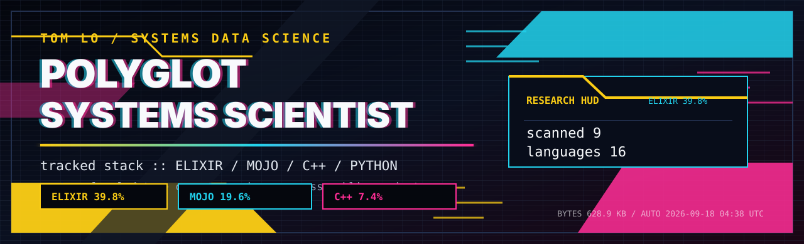
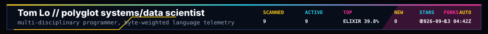
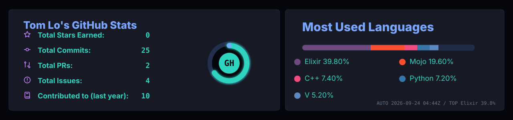

<!-- AUTO-GENERATED by scripts/build_readme.py. Edit the script, not this file. -->

<p align="center">
  
</p>

<p align="center">
  
</p>

<p align="center">
  <a href="https://github.com/TomLo-FStack?tab=repositories"></a>
  
  
  
  
  
</p>

## Language Matrix

**Positioning:** byte-weighted public source profile across Elixir, Mojo, C++, and Python, tracking 9 source repositories, 9 active projects, and 16 detected languages from GitHub repository data.

<p align="center">


</p>

No new languages since the last daily scan.

| Language | Share | Bytes | Seen in repos |
| --- | ---: | ---: | --- |
| `Elixir` | `39.8%` | `250.3 KB` | elixir-luv-v |
| `Mojo` | `19.6%` | `123.3 KB` | Lo, mojo-data-structures-50 |
| `C++` | `7.4%` | `46.3 KB` | win-liquid-glass |
| `Python` | `7.2%` | `45.3 KB` | ds50-speedforge, elixir-luv-v, pixel-cat-web, rk-euler-teaching-site |
| `V` | `5.2%` | `32.8 KB` | ds50-speedforge |
| `Go` | `4.9%` | `30.7 KB` | ds50-speedforge |
| `PowerShell` | `4.5%` | `28.0 KB` | ds50-speedforge, elixir-luv-v, mojo-data-structures-50, pony-fin-terminal |
| `TypeScript` | `3.8%` | `23.7 KB` | pixel-cat-web, rk-euler-teaching-site |

## Mission Control

Systems builder focused on data structures, language experiments, and fast tooling.

Current work clusters around data structures, benchmarks, CLI tools, and language experiments. The heaviest source footprint is Elixir, Mojo, and C++, based on 628.9 KB of language bytes from public non-fork source repositories.

```text
identity :: Tom Lo / Elixir, Mojo, and C++
focus    :: data structures, benchmarks, CLI tools, and language experiments
repos    :: 9 active / 9 scanned
signals  :: stars 0 / forks 0 / new languages none
scan     :: daily GitHub language bytes / 2026-07-19 03:50 UTC
```

## Project Radar

<table>
<tr>
<td width="50%" valign="top">
<a href="https://github.com/TomLo-FStack/win-liquid-glass"><strong>win-liquid-glass</strong></a><br/>
<span>Prototype: native Windows Liquid Glass refraction lens — D3D11 + DXGI Desktop Duplication + DirectComposition. A draggable topmost lens that optically refracts the live desktop behind it.</span><br/><br/>
  <br/>
<sub>last push: <code>2026-06-25</code></sub>
</td>
<td width="50%" valign="top">
<a href="https://github.com/TomLo-FStack/pixel-cat-web"><strong>pixel-cat-web</strong></a><br/>
<span>No description yet.</span><br/><br/>
  <br/>
<sub>last push: <code>2026-06-05</code></sub>
</td>
</tr>
<tr>
<td width="50%" valign="top">
<a href="https://github.com/TomLo-FStack/rk-euler-teaching-site"><strong>rk-euler-teaching-site</strong></a><br/>
<span>No description yet.</span><br/><br/>
  <br/>
<sub>last push: <code>2026-05-10</code></sub>
</td>
<td width="50%" valign="top">
<a href="https://github.com/TomLo-FStack/Lo"><strong>Lo</strong></a><br/>
<span>Mojo-native HTTP/1.1 core for local services and internal APIs</span><br/><br/>
  <br/>
<sub>last push: <code>2026-04-30</code></sub>
</td>
</tr>
<tr>
<td width="50%" valign="top">
<a href="https://github.com/TomLo-FStack/elixir-luv-v"><strong>elixir-luv-v</strong></a><br/>
<span>Elixir Luv V: a polished Julia-style REPL shell for V</span><br/><br/>
  <br/>
<sub>last push: <code>2026-04-30</code></sub>
</td>
<td width="50%" valign="top">
<a href="https://github.com/TomLo-FStack/pony-fin-terminal"><strong>pony-fin-terminal</strong></a><br/>
<span>A small Pony finance terminal backed by public Stooq quote CSV data</span><br/><br/>
  <br/>
<sub>last push: <code>2026-04-30</code></sub>
</td>
</tr>
</table>

## Toolchain

<p align="center">


</p>

## Live Telemetry

<p align="center">
  
</p>

<p align="center">
  
</p>

<p align="center">
  
</p>

## Latest Public Pushes

- [win-liquid-glass](https://github.com/TomLo-FStack/win-liquid-glass) - Prototype: native Windows Liquid Glass refraction lens — D3D11 + DXGI Desktop Duplication + DirectComposition. A draggable topmost lens that optically refracts the live desktop behind it. | `C++` | stars `0` | forks `0` | pushed `2026-06-25`
- [BlameEngine](https://github.com/TomLo-FStack/BlameEngine) - Blame Engine — headless authoritative-world game engine (UE5 view client + Jolt physics; real-code hacking sandbox) | `Mixed` | stars `0` | forks `0` | pushed `2026-06-06` fork
- [pixel-cat-web](https://github.com/TomLo-FStack/pixel-cat-web) - No description yet. | `Python` | stars `0` | forks `0` | pushed `2026-06-05`
- [rk-euler-teaching-site](https://github.com/TomLo-FStack/rk-euler-teaching-site) - No description yet. | `TypeScript` | stars `0` | forks `0` | pushed `2026-05-10`
- [Lo](https://github.com/TomLo-FStack/Lo) - Mojo-native HTTP/1.1 core for local services and internal APIs | `Mojo` | stars `0` | forks `0` | pushed `2026-04-30`
- [elixir-luv-v](https://github.com/TomLo-FStack/elixir-luv-v) - Elixir Luv V: a polished Julia-style REPL shell for V | `Elixir` | stars `0` | forks `0` | pushed `2026-04-30`
- [come-lang](https://github.com/TomLo-FStack/come-lang) - Come (C Object and Module Extensions) is a systems programming language inspired by C. It preserves C’s mental model while removing common pitfalls. | `C` | stars `0` | forks `0` | pushed `2026-04-30` fork
- [pony-fin-terminal](https://github.com/TomLo-FStack/pony-fin-terminal) - A small Pony finance terminal backed by public Stooq quote CSV data | `PowerShell` | stars `0` | forks `0` | pushed `2026-04-30`

## Automation

This profile README updates itself from GitHub Actions every day. The workflow scans public repository language bytes, detects languages that were not in the previous snapshot, rebuilds this page, and commits the refreshed README plus `assets/language-stats.json`.

<sub>Last generated: 2026-07-19 03:50 UTC</sub>
